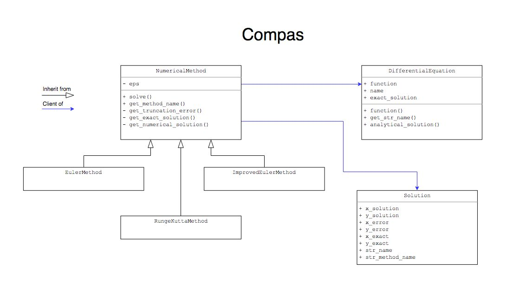

# DE_Compas
## Differential Equations F18 COMPutational ASsingment

This application implements Euler, Improved Euler and Runge-Kutta numerical methods for solving initial value problem fot first order differential equations in general explicit form.

## Technologies used

- Python 3.6
- Kivy 1.10.1 (GUI framework)
- Matplotlib (Plots)

## Instalation
Firstly you should install Python 3.6 (or higher) environment.

    https://www.python.org/downloads/

Next install kivy

    https://kivy.org/doc/stable/installation/installation.html

Then Matplotlib

    https://matplotlib.org/users/installing.html

And, finally, Matplotlib package for kivy.

    pip install kivy-garden
    garden install matplotlib

To run application, execute `main.py` in the Python environment

## Description

This application implements Euler, Improved Euler and Runge-Kutta numerical methods for solving initial value problem fot first order differential equations in general explicit form.

Application consists of GUI part and several backend classes that are described in the UML diagram below.

- NumericalMethod is a base class for numerical methods
- DifferentialEquation is a class representing differential equation with its exact solution
- Solution is a class which contains numerical and exact solutions, truncation error, name of method applied and name of equation (formula). Objects of this class supposed to be used in GUI or other elements of application which don't necessary contain information about differential equation and initial value problem solved.

The equation that this application solves is described in the document together with exact solution

[Link to the solution](docs/Differential_equation_solution.pdf)

